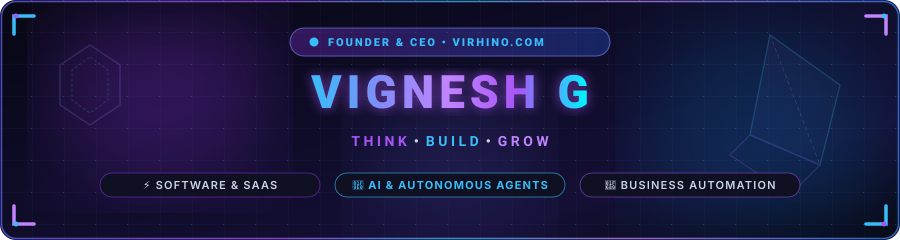
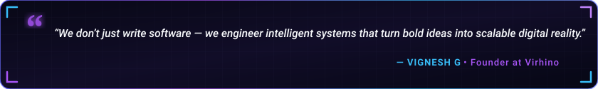

  

  

  
  &nbsp;
  
  &nbsp;
  
  &nbsp;
  
  &nbsp;
  
  &nbsp;
  

  

---

<h2 align="center">🔮 About Me &amp; Virhino</h2>

  

  I'm <b>Vignesh G</b>, Founder &amp; Lead Systems Architect at <b><a href="https://www.virhino.com" target="_blank">Virhino</a></b> based in Chennai, India. 
  We partner with high-growth startups and established enterprises to build <b>custom software</b>, deploy <b>autonomous AI agents</b>, automate <b>mission-critical business operations</b>, and power <b>exponential digital growth</b>.

  
  &nbsp;
  
  &nbsp;
  
  &nbsp;
  

  💬 <b>Core Expertise:</b> Autonomous AI Agents, RAG Pipelines, SaaS Platforms, Event-Driven Architectures &amp; Cross-Cloud Integrations. 
  ⚡ <b>Mission:</b> <i>"Technology shouldn't just exist — it should solve real business bottlenecks and compound measurable value."</i>

<table width="100%" border="0" align="center">
<tr>
<td width="50%" align="center" style="padding: 16px;">
  <h4>🏗️ 01. Build — Software &amp; SaaS</h4>
  
<a href="https://www.virhino.com/services/software-development/" target="_blank"><b>Web, Mobile &amp; Cloud Platforms</b></a> Bespoke SaaS, React/Next.js &amp; Flutter apps

</td>
<td width="50%" align="center" style="padding: 16px;">
  <h4>🧠 02. Intelligence — AI Solutions</h4>
  
<a href="https://www.virhino.com/services/ai-solutions/" target="_blank"><b>AI Agents &amp; Generative AI</b></a> Voice AI, LLM Pipelines &amp; Computer Vision

</td>
</tr>
<tr>
<td width="50%" align="center" style="padding: 16px;">
  <h4>⚙️ 03. Automate — Business Workflows</h4>
  
<a href="https://www.virhino.com/services/business-automation/" target="_blank"><b>End-to-End Orchestration</b></a> CRM, ERP, Webhooks &amp; Automated Hand-offs

</td>
<td width="50%" align="center" style="padding: 16px;">
  <h4>🚀 04. Grow — Digital Scaling</h4>
  
<a href="https://www.virhino.com/services/digital-marketing/" target="_blank"><b>Market Authority &amp; Demand Funnels</b></a> Technical SEO, Performance Media &amp; Positioning

</td>
</tr>
</table>

---

<h2 align="center">💎 Featured Products &amp; Innovations Spotlight</h2>

<table width="100%" border="0" align="center">
<tr>
<td width="50%" align="center" style="padding: 18px;">
  <h3>🧾 Virhino Bill</h3>
  
<i>High-performance retail billing, inventory tracking, and POS platform with offline-first local cache &amp; real-time GST tax invoicing.</i>

  
<b>Stack:</b> <code>React</code> <code>Node.js</code> <code>PostgreSQL</code> <code>IndexedDB</code>

  
</td>
<td width="50%" align="center" style="padding: 18px;">
  <h3>🎙️ AI Voice Agent</h3>
  
<i>Sub-400ms conversational voice intelligence engineered for autonomous phone dispatch, qualification, and automated CRM transcription.</i>

  
<b>Stack:</b> <code>Python</code> <code>WebRTC</code> <code>Whisper</code> <code>Twilio Voice</code>

  
</td>
</tr>
<tr>
<td width="50%" align="center" style="padding: 18px;">
  <h3>🔊 SparkSounds</h3>
  
<i>On-device acoustic classification engine converting critical ambient environmental audio events into tactile haptic feedback for accessibility.</i>

  
<b>Stack:</b> <code>TensorFlow Lite</code> <code>Flutter</code> <code>DSP</code>

  
</td>
<td width="50%" align="center" style="padding: 18px;">
  <h3>🌿 Crop AI</h3>
  
<i>Edge &amp; cloud agricultural pathology vision system analyzing multi-spectral mobile imagery to detect foliar disease outbreaks before spreading.</i>

  
<b>Stack:</b> <code>PyTorch</code> <code>FastAPI</code> <code>MobileNetV4</code>

  
</td>
</tr>
</table>

---

<h2 align="center">🛠️ Technical Arsenal &amp; Architecture Stack</h2>

<b>🤖 Artificial Intelligence &amp; Autonomous Agents</b>

  

  
  &nbsp;
  
  &nbsp;
  
  &nbsp;
  

<b>🌐 Modern Full-Stack &amp; Web Engineering</b>

  

<b>⚙️ Backend, Databases &amp; Cloud Infrastructure</b>

  

<b>📱 Mobile, Edge &amp; Workflow Automation</b>

  

---

<h2 align="center">📊 Real-Time Engineering Telemetry</h2>

  
  &nbsp;&nbsp;
  

  

  

---

<h2 align="center">🤝 Let's Connect &amp; Build Together</h2>

<i>Whether you're looking to architect a new SaaS, deploy enterprise AI agents, or scale your technical team — let's have a conversation!</i>

<table border="0" align="center">
<tr>
<td align="center" width="220" style="padding: 18px;">
  <a href="https://www.virhino.com" target="_blank">
    
      
    
  </a>
   
  <b>Official Digital Studio</b>
</td>
<td align="center" width="220" style="padding: 18px;">
  <a href="https://www.linkedin.com/in/vignesh220904/" target="_blank">
    
      
    
  </a>
   
  <b>Executive Network</b>
</td>
<td align="center" width="220" style="padding: 18px;">
  <a href="mailto:info@virhino.com">
    
      
    
  </a>
   
  <b>Direct Inquiries</b>
</td>
</tr>
</table>

  

